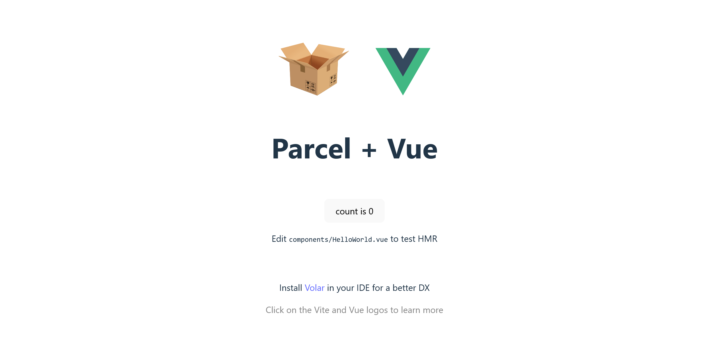

# Parcel Vue Template

> Parcel starter template for Vue.js.

This is a starter [Parcel](https://parceljs.org) template with [Vue.js](https://vuejs.org/).



Included  features :

- Linting with [Prettier](https://prettier.io/)
- Module bundling with [Parcel](https://parceljs.org/)
- Deleting directories with [Rimraf](https://github.com/isaacs/rimraf)

## Install:

```
npm install
```

## To run:

```
npm start
```

Open browser on [http://localhost:1234](http://localhost:1234) to view the app.

## To build:

```
npm run build
```

## To clean:

```
npm run clean
```

## To style code:

```
npm run format
```

## To check code format:

```
npm run lint
```

